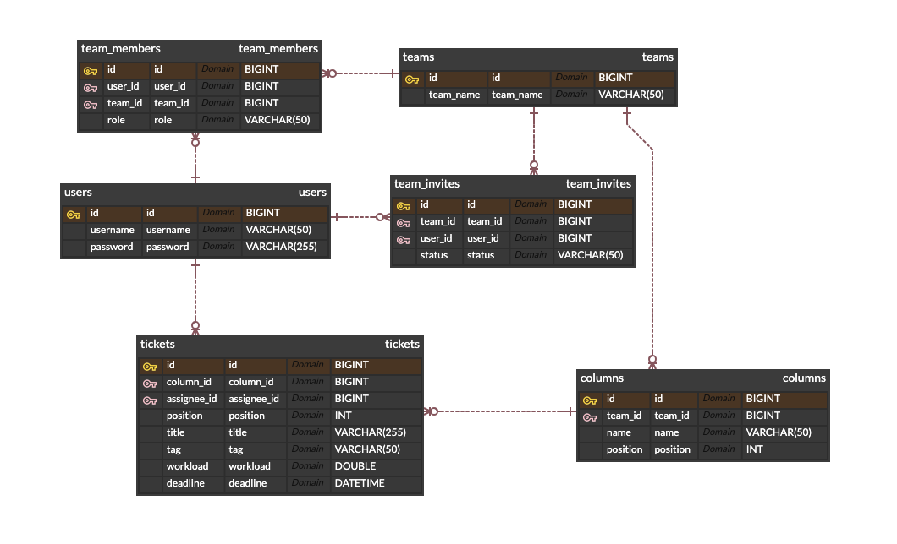

## 프로젝트 개요
> 본 서비스는 기업 내부에서 사용되는 웹 서비스로, 프로젝트와 작업 관리를 위한 직관적이고 유연한 도구로, 팀 간 협업과 업무 효율성을 향상시키는데 목적을 두고 있습니다.

<br/>

## 개발환경
```
• IDE : IntelliJ IDEA Ultimate
• 언어 : Java 17
• 프레임워크 : Spring Boot 3.1.5
• 빌드 도구 : Gradle
• 데이터베이스 : MySQL 8.0
```

</a>
</a>
</a>
</a>
</a>
</a>
</a>
</a>
</a>
</a>

<br/>

## 주요기능
> [요구사항 명세](https://docs.google.com/document/d/1tN0aXgr13YclqWS5e-Fxdkqnccc2tBYCMbHxRiIx5vs/edit)


<br/>

## ERD (모델링)


<br/>

## API 명세


<br/>

## 이슈 및 해결

- [API 설계 시 고민]()
- [칸반보드 열, 티켓 이동 알고리즘]()

<br/>


---